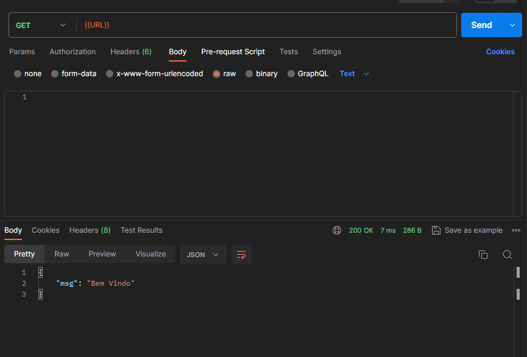
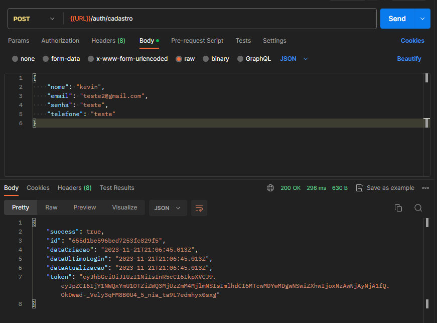
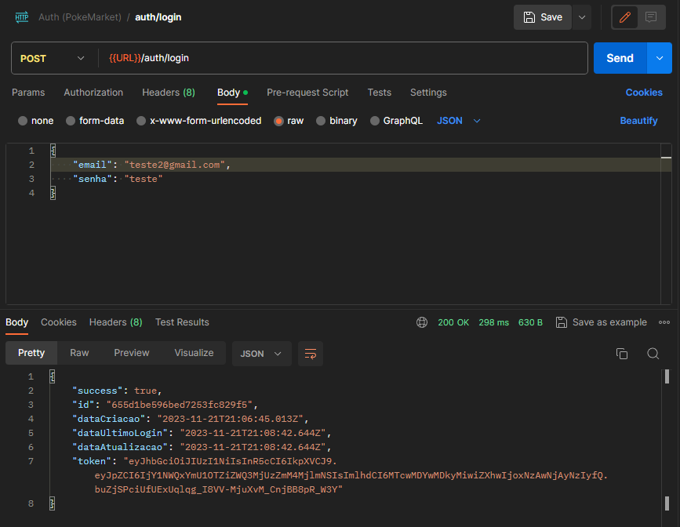
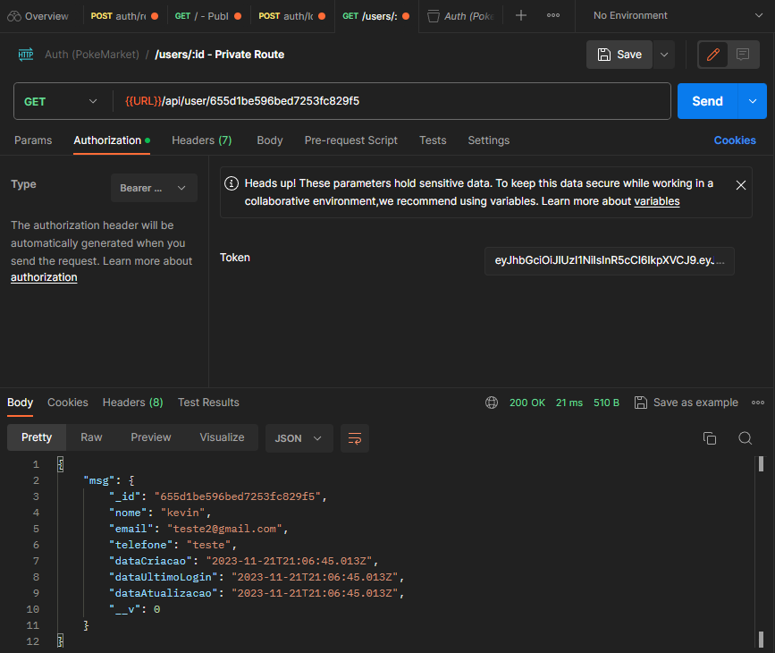

# Escribo Auth

### Instalação

Antes de começar, é necessário ter: [Node.js](https://nodejs.org/).

### Como utilizar

1) Navegue até o diretório do projeto:

    ```bash
    cd Escribo-Auth
    ```

2) Instale as dependências utilizando:

    ```bash
    npm install
    ```

3) Inicie a aplicação utilizando:

    ```bash
    npm start
    ```

    3.1 Iniciar a aplicação pelo ambiente de desenvolvimento
        
    ```bash
    npm run dev
    ```
    3.2 Iniciar o build
        
    ```bash
    npm run build
    ```

4) Após iniciar utilize a Url:

    ```bash
    Utilize está URL: http://localhost:3000
    ```
### Testes
Eu utilizei a ferramenta postman para realização dos testes.

1) Rota: http://localhost:3000/


2) Rota: http://localhost:3000/auth/cadastro


3) Rota: http://localhost:3000/auth/login


4) Rota: http://localhost:3000/api/user/:id
